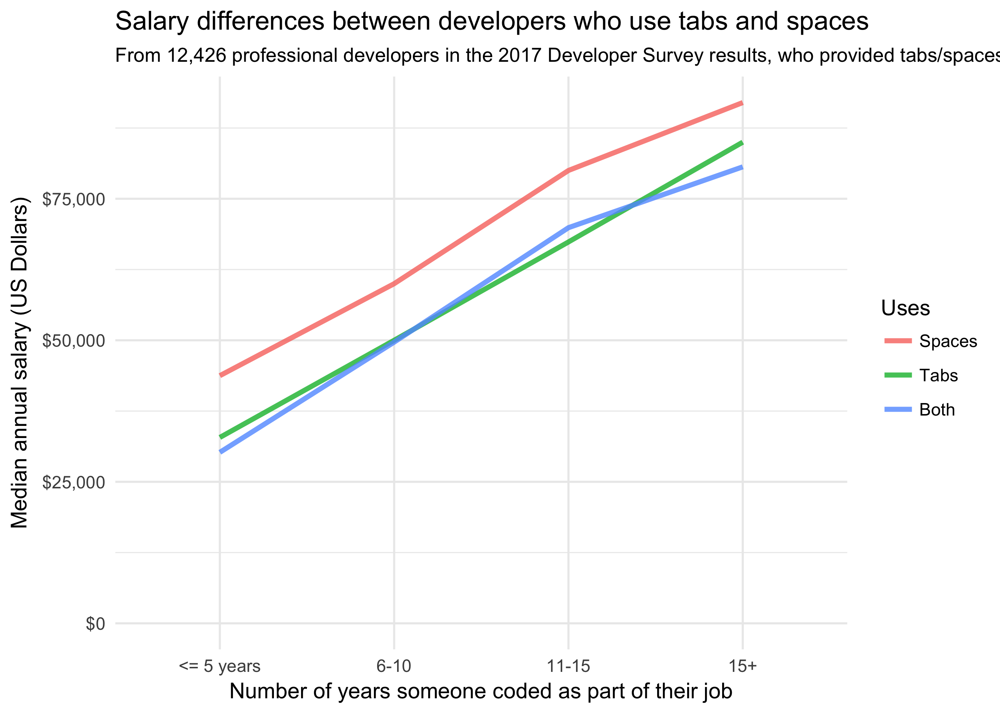
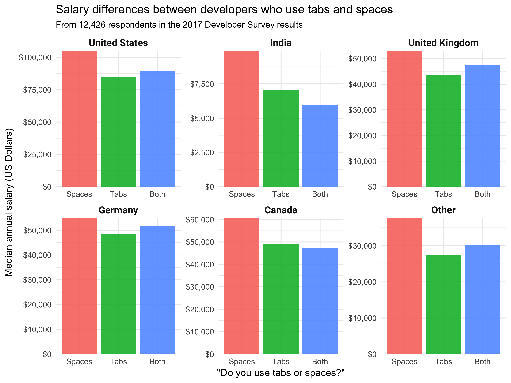
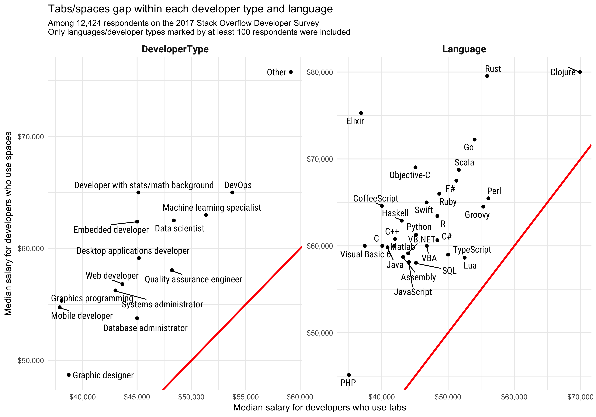

```r
library(tidyverse)

survey_results <- read_csv("developer_survey_2017/survey_results_public.csv")

tab_space_survey <- survey_results %>%
  filter(!is.na(TabsSpaces)) %>%
  mutate(TabsSpaces = factor(TabsSpaces, c("Spaces", "Tabs", "Both"))) %>%
  extract(YearsCodedJob, "YearsCodedNumber", "(\\d+)", convert = TRUE) %>%
  replace_na(list(YearsCodedNumber = 0)) %>%
  mutate(YearsCodedGroup = case_when(YearsCodedNumber < 5 ~ "<= 5 years",
                                     YearsCodedNumber <= 10 ~ "6-10",
                                     YearsCodedNumber <= 15 ~ "11-15",
                                     TRUE ~ "15+"),
         YearsCodedGroup = reorder(YearsCodedGroup, YearsCodedNumber, mean)) %>%
  filter(Professional == "Professional developer")
```

Do you use tabs or spaces for code indentation?

This is a bit of a ["holy war"](https://blog.codinghorror.com/death-to-the-space-infidels/) among software developers; one that's been the subject of many debates and in-jokes. I use spaces, but I never thought it was particularly important. But today we're [releasing the raw data](https://insights.stackoverflow.com/survey/?utm_source=so-owned&utm_medium=blog&utm_campaign=dev-survey-2017&utm_content=blog-link&utm_term=data) behind the [Stack Overflow 2017 Developer Survey](https://insights.stackoverflow.com/survey/2017), and some analysis suggests this choice matters more than I expected.

### Spaces make more money than tabs

There were 28,657 survey respondents who provided an answer to tabs versus spaces and who considered themselves a professional developer (as opposed to a student or former programmer). Within this group, 40.7% use tabs and 41.8% use spaces (with 17.5% using both). Of them, 12,426 also provided their salary.

Analyzing the data leads us to an interesting conclusion. **Coders who use spaces for indentation make more money than ones who use tabs,** even if they have the same amount of experience:


```r
survey_set <- tab_space_survey %>%
  filter(!is.na(Salary))

survey_set %>%
  group_by(TabsSpaces, YearsCodedGroup) %>%
  summarize(MedianSalary = median(Salary), Observations = n(),
            MeanYears = mean(YearsCodedNumber)) %>%
  ungroup() %>%
  ggplot(aes(YearsCodedGroup, MedianSalary,
             group = TabsSpaces, color = TabsSpaces)) +
  geom_line(size = 1.2, alpha = 0.8) +
  scale_y_continuous(labels = dollar_format()) +
  expand_limits(y = 0) +
  labs(color = "Uses",
       x = "Number of years someone coded as part of their job",
       y = "Median annual salary (US Dollars)",
       title = "Salary differences between developers who use tabs and spaces",
       subtitle = paste("From", comma(nrow(survey_set)), "professional developers in the 2017 Developer Survey results, who provided tabs/spaces and salary"))
```




```r
medians <- survey_set %>%
  group_by(TabsSpaces) %>%
  summarize(Median = median(Salary)) %>%
  arrange(TabsSpaces)
```

Indeed, the median developer who uses spaces had a salary of $59,140, while the median tabs developer had a salary of $43,750. (Note that all the results were converted into US dollars from each respondent's currency). Developers who responded "Both" were generally indistinguishable from ones who answered "Tabs": I'll leave them out of many of the remaining analyses.

This is an amusing result, but of course it's not conclusive by itself. When I first discovered this effect, I assumed that it was confounded by a factor such as country or programming language. For example, it's conceivable that developers in low GDP-per-capita countries could be more likely to use tabs, and therefore such developers tend to have lower salaries on average.

We could examine this by considering whether the effect occurs **within each country**, for several of the countries that had the most survey respondents.


```r
countries <- c("United States", "India", "United Kingdom", "Germany",
               "Canada", "Other")

survey_set <- tab_space_survey %>%
  filter(Professional == "Professional developer") %>%
  filter(!is.na(Salary)) %>%
  mutate(Country = fct_lump(Country, 5))

survey_set %>%
  group_by(Country, TabsSpaces) %>%
  summarize(MedianSalary = median(Salary)) %>%
  ungroup() %>%
  mutate(Country = factor(Country, countries)) %>%
  ggplot(aes(TabsSpaces, MedianSalary, fill = TabsSpaces)) +
  geom_col(alpha = 0.9, show.legend = FALSE) +
  theme(strip.text.x = element_text(size = 11, family = "Roboto-Bold")) +
  facet_wrap(~ Country, scales = "free") +
  labs(x = '"Do you use tabs or spaces?"',
       y = "Median annual salary (US Dollars)",
       title = "Salary differences between developers who use tabs and spaces",
       subtitle = paste("From", comma(nrow(survey_set)), "respondents in the 2017 Developer Survey results")) +
  scale_y_continuous(labels = dollar_format(), expand = c(0,0))
```



The effect is smaller in Europe and especially large in India, but it does appear within each country, suggesting this isn't the sole confounding factor.

As another hypothesis, [we know that different types of developers](https://twitter.com/drob/status/844599055779090432) often use different indentation (e.g. with DevOps developers more likely to use spaces and mobile developers more likely to use tabs), often because they use different editors and languages. The Developer Survey asked both about what programming languages each respondent uses (Python, Javascript, etc) and what "type" of developer they are (web developer, embedded developer, etc).

Did we see the same tabs/spaces gap within each of these groups?


```r
survey_set <- tab_space_survey %>%
  filter(Professional == "Professional developer") %>%
  filter(!is.na(Salary), !is.na(DeveloperType))

library(stringr)
library(forcats)
library(ggrepel)

dev_types <- survey_set %>%
  select(Respondent, DeveloperType) %>%
  unnest(Type = str_split(DeveloperType, "; ")) %>%
  mutate(Type = fct_recode(Type,
                           "Developer with stats/math background" = "Developer with a statistics or mathematics background",
                           "DevOps" = "DevOps specialist",
                           "Embedded developer" = "Embedded applications/devices developer")) %>%
  transmute(Respondent, Type, TypeCategory = "DeveloperType")

languages <- survey_set %>%
  select(Respondent, HaveWorkedLanguage) %>%
  unnest(Type = str_split(HaveWorkedLanguage, "; ")) %>%
  transmute(Respondent, Type, TypeCategory = "Language")

person_dev_types <- dev_types %>%
  bind_rows(languages) %>%
  inner_join(survey_set, by = "Respondent") %>%
  group_by(Type)
```


```r
person_dev_types %>%
  group_by(TypeCategory, Type, TabsSpaces) %>%
  summarize(MedianSalary = median(Salary), Observations = n()) %>%
  mutate(TypeTotal = sum(Observations)) %>%
  select(-Observations) %>%
  spread(TabsSpaces, MedianSalary) %>%
  ungroup() %>%
  filter(Type != "", TypeTotal >= 100) %>%
  ggplot(aes(Tabs, Spaces)) +
  geom_point() +
  geom_text_repel(aes(label = Type), point.padding = unit(0.1, "lines"),
                  family = "RobotoCondensed-Regular") +
  geom_abline(color = "red", size = 1.1) +
  scale_x_continuous(labels = dollar_format()) +
  scale_y_continuous(labels = dollar_format()) +
  facet_wrap(~ TypeCategory, scales = "free") +
  theme(strip.text.x = element_text(size = 12, family = "Roboto-Bold")) +
  labs(x = "Median salary for developers who use tabs",
       y = "Median salary for developers who use spaces",
       title = "Tabs/spaces gap within each developer type and language",
       subtitle = paste("Among", comma(n_distinct(person_dev_types$Respondent)), "respondents on the 2017 Stack Overflow Developer Survey \nOnly languages/developer types marked by at least 100 respondents were included"))
```



No, the effect existed within every subgroup of developers. (This gave a similar result even when filtering for developers only in a specific country, or for ones with a specific range of experience). Note that respondents could select multiple languages, so each of these groups are overlapping to some degree.

I did several other visual examinations of possible confounding factors (such as level of education or company size), and found basically the same results: spaces beat tabs within every group. Now that the [raw data](https://insights.stackoverflow.com/survey/?utm_source=so-owned&utm_medium=blog&utm_campaign=dev-survey-2017&utm_content=blog-link&utm_term=data) is available, I encourage other statisticians to check other confounders themselves.

### Estimating the effect


```r
# Include each of the developer types that has at least 200 people
all_dev_types <- person_dev_types %>%
  filter(!is.na(Type)) %>%
  select(Respondent, Type) %>%
  ungroup() %>%
  mutate(Value = 1) %>%
  spread(Type, Value, fill = 0)
```

If we control for all of the factors that we suspect could affect salary, how much effect does the choice of tabs/spaces have?

To answer this, I fit a linear regression, predicting salary based on the following factors.

* Tabs vs spaces
* Country
* Years of programming experience
* Developer type and language (for the 49 responses with at least 200 "yes" answers)
* Level of formal education (e.g. bachelor's, master's, doctorate)
* Whether they contribute to open source
* Whether they program as a hobby
* Company size


```r
prepared_data <- tab_space_survey %>%
  group_by(Country) %>%
  filter(n() >= 500) %>%
  ungroup() %>%
  filter(Salary >= 1000,
         !CompanySize %in% c("I prefer not to answer", "I don't know"),
         FormalEducation != "I prefer not to answer") %>%
  mutate(TabsSpaces = relevel(TabsSpaces, "Tabs"),
         OpenSource = str_detect(ProgramHobby, "both|open source"),
         Hobby = str_detect(ProgramHobby, "both|hobby")) %>%
  select(Respondent, Country, Salary, YearsCodedNumber, FormalEducation, OpenSource, Hobby, TabsSpaces, CompanySize) %>%
  inner_join(all_dev_types, by = "Respondent") %>%
  select(-Respondent)

library(broom)
coefficients <- lm(log(Salary) ~ 0 + ., data = prepared_data) %>%
  tidy(conf.int = TRUE) %>%
  mutate(estimate = exp(estimate) - 1) %>%
  filter(term %in% c("YearsCodedNumber", "TabsSpacesSpaces"))
```

The model estimated that **using spaces instead of tabs leads to a 8.6% higher salary** (confidence interval (6.01%, 10.5%), p-value < 10^-10). (By predicting the logarithm of the salary, we were able to estimate the **% change** each factor contributed to a salary rather than the dollar amount). Put another way, **using spaces instead of tabs was worth as much as an extra 2.4 years of experience**.

### Conclusion

So... this is certainly a surprising result, one that I didn't expect to find when I started exploring the data. And it is impressively robust even when controlling for many confounding factors. As an exercise I tried controlling for many other confounding factors within the survey data beyond those mentioned here, but it was difficult to make the effect shrink and basically impossible to make it disappear.

Correlation is not causation, and we can never be sure that we've controlled for all the confounding factors present in a dataset. If you're a data scientist, statistician, or analyst, I encourage you to download [download the raw survey data](https://insights.stackoverflow.com/survey/?utm_source=so-owned&amp;utm_medium=blog&amp;utm_campaign=dev-survey-2017&amp;utm_content=blog-link&amp;utm_term=data) and examine it for yourself. In any case we'd be interested in hearing hypotheses about this relationship.

Though for the sake of my own salary, I'm sticking with spaces for now.
